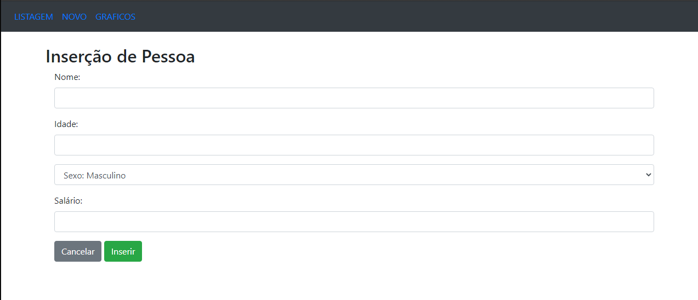
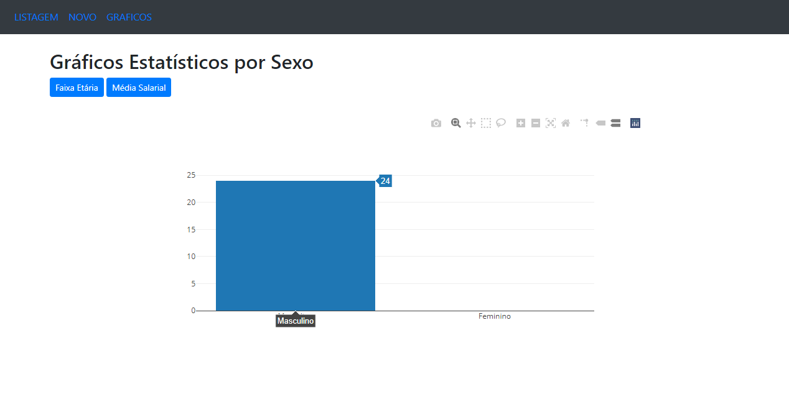
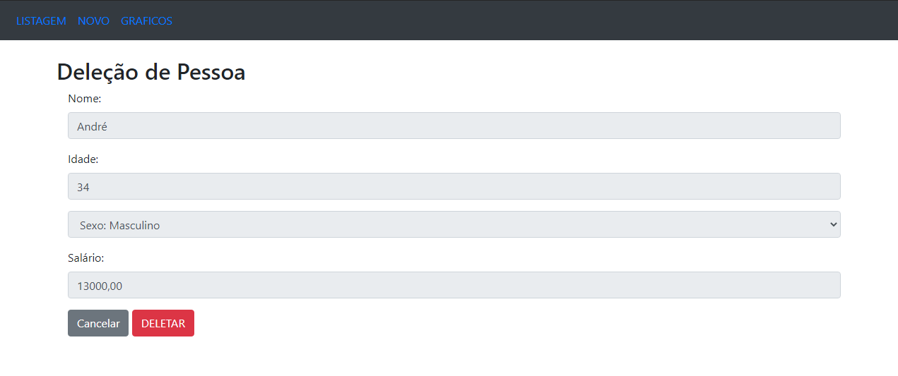
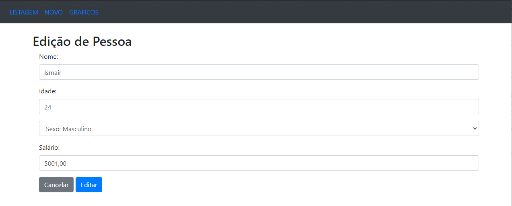

# CRUD-Django-3
Repositório de CRUD usando Django 3

Sistema de cadastro de pessoas informando nome, idade, sexo e salário!
Foi desenvolvidas as operações de CRUD e métodos de ordenação dos dados inseridos, além de permitir exportar o relatório em formato pdf.

